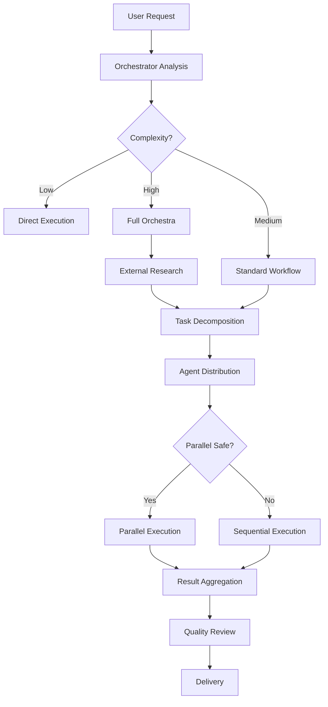

# Development Workflow - Intelligent Orchestration System

**Command**: `/dev-workflow` or `/dw`
**Purpose**: Execute intelligent development workflow with research, decomposition, and optimized agent coordination
**Orchestrator**: @orchestrator (Opus 4.1)

## Usage

```
/dev-workflow <request>
```

Examples:
- `/dw Implement OAuth authentication with Google`
- `/dw Add real-time notifications using WebSockets`
- `/dw Optimize database queries for performance`
- `/dw Create comprehensive test suite`

## Workflow Architecture



## Phase 1: INTELLIGENT ANALYSIS

### Request Enhancement
The orchestrator first improves and clarifies the request:
- Identify implicit requirements
- Add technical specifications
- Define success criteria
- Specify constraints

### Complexity Assessment
```python
def assess_complexity(request):
    factors = {
        "files_affected": count_potential_files(),
        "external_integrations": check_external_deps(),
        "security_sensitive": is_security_related(),
        "performance_critical": is_performance_related(),
        "breaking_changes": may_break_existing(),
        "new_technology": requires_learning()
    }
    
    score = calculate_weighted_score(factors)
    
    if score < 3: return "LOW"
    elif score < 7: return "MEDIUM"
    else: return "HIGH"
```

## Phase 2: INTELLIGENT RESEARCH

### Triggered When
- Complexity = HIGH
- New technology/library
- Security-critical features
- Performance optimizations
- External integrations

### Research Matrix
| Source | Purpose | Priority |
|--------|---------|----------|
| Perplexity | Latest best practices, trends | HIGH |
| Ref | Official documentation | HIGH |
| GitHub | Real implementations, issues | MEDIUM |
| Context7 | Library-specific docs | MEDIUM |
| WebSearch | Additional context | LOW |

### Research Output Structure
```json
{
  "timestamp": "2024-01-01T10:00:00Z",
  "sources_consulted": 5,
  "key_findings": {
    "best_practices": [],
    "security_notes": [],
    "performance_tips": [],
    "common_mistakes": [],
    "recommended_libraries": []
  },
  "implementation_strategy": "detailed approach",
  "estimated_effort": "hours/days",
  "risk_assessment": "low/medium/high"
}
```

## Phase 3: SURGICAL DECOMPOSITION

### Decomposition Principles
1. **Atomic Tasks**: Each task does ONE thing
2. **Clear Boundaries**: No overlap between tasks
3. **Explicit Dependencies**: Define execution order
4. **Measurable Output**: Clear success criteria

### Task Template
```yaml
task_id: "task-001"
description: "Implement OAuth provider configuration"
assigned_to: "@backend-developer"
dependencies: []
can_parallel: true
estimated_time: "30 min"
inputs:
  - research_results: "/workflow-state/research.json"
  - project_config: "/config/auth.yaml"
outputs:
  - oauth_config: "/config/oauth-providers.json"
  - env_variables: "/.env.local"
validation:
  - "OAuth URLs configured"
  - "Client ID/Secret stored"
  - "Redirect URIs set"
```

## Phase 4: OPTIMIZED EXECUTION

### Parallel Execution Matrix
| Safe to Parallelize ✅ | Must be Sequential ❌ |
|------------------------|----------------------|
| Different file reads | Same file edits |
| Independent MCPs | Dependent tasks |
| Separate directories | Migrations then code |
| Different test suites | Build then deploy |
| Analysis tasks | API then frontend |

### Execution Strategies

#### Strategy A: Maximum Parallel
```
Group 1: [Backend tasks] ──┐
Group 2: [Frontend tasks] ──┼──> Integration ──> Testing
Group 3: [Database tasks] ──┘
```

#### Strategy B: Phased Parallel
```
Phase 1: [Research + Analysis] (parallel)
    ↓
Phase 2: [Core Implementation] (parallel where safe)
    ↓
Phase 3: [Integration + Testing] (sequential)
```

#### Strategy C: Pipeline
```
Research → Design → Implement → Test → Review → Deploy
```

## Phase 5: CONTEXT SYNCHRONIZATION

### Shared State Location
`/workflow-state/current-task.json`

### State Update Protocol
```javascript
{
  "workflow_id": "wf-uuid",
  "last_update": "timestamp",
  "phase": "research|decomposition|execution|review",
  "progress": {
    "total_tasks": 10,
    "completed": 3,
    "in_progress": 2,
    "blocked": 0
  },
  "agent_status": {
    "@frontend-developer": "working on task-003",
    "@backend-developer": "completed task-001",
    "@code-reviewer": "waiting"
  },
  "shared_decisions": [
    {
      "decision": "Use NextAuth for OAuth",
      "rationale": "Best integration with Next.js",
      "made_by": "@orchestrator",
      "timestamp": "..."
    }
  ],
  "blockers": [],
  "artifacts": {
    "research": "/workflow-state/research-results.md",
    "schemas": "/workflow-state/database-schema.sql",
    "api_spec": "/workflow-state/api-specification.yaml"
  }
}
```

## Phase 6: QUALITY ASSURANCE

### Automatic Quality Gates
- [ ] All subtasks completed
- [ ] No merge conflicts
- [ ] Tests passing (if exist)
- [ ] No security warnings
- [ ] Performance acceptable
- [ ] Code review approved

### Review Checklist
```markdown
## Pre-Completion Checklist
- [ ] Functionality matches request
- [ ] Edge cases handled
- [ ] Error handling implemented
- [ ] Documentation updated
- [ ] Tests written (if applicable)
- [ ] Security validated
- [ ] Performance verified
- [ ] Accessibility checked
- [ ] Mobile responsive (if UI)
- [ ] Backwards compatible
```

## Intelligent Features

### 1. Learning System
The orchestrator remembers patterns:
```json
{
  "pattern": "oauth_implementation",
  "successful_approach": "NextAuth with Prisma adapter",
  "time_saved": "2 hours",
  "reuse_count": 3
}
```

### 2. Predictive Parallelization
Based on task analysis, predicts safe parallel groups:
```python
if "database" not in task1.affects and "database" not in task2.affects:
    mark_as_parallel(task1, task2)
```

### 3. Auto-Recovery
If agent fails, orchestrator:
1. Analyzes failure
2. Attempts auto-fix
3. Reassigns if needed
4. Updates strategy

### 4. Progressive Enhancement
Start with MVP, then enhance:
```
Iteration 1: Basic functionality
Iteration 2: Error handling
Iteration 3: Performance optimization
Iteration 4: Polish and UX
```

## Example Workflows

### Example 1: OAuth Implementation (HIGH Complexity)
```
1. Research: OAuth 2.0, PKCE, token storage
2. Decompose:
   - DB schema for users/sessions
   - OAuth provider configuration
   - API endpoints
   - Frontend login flow
   - Token refresh logic
   - Security audit
3. Execute: DB + Config (parallel), then API, then Frontend
4. Review: Security validation
```

### Example 2: Bug Fix (LOW Complexity)
```
1. Analyze: Single file, typo in function
2. Execute: Direct to @code-reviewer
3. Complete: Fixed in 1 minute
```

### Example 3: New Feature (MEDIUM Complexity)
```
1. Analyze: 3 files, new API endpoint + UI
2. Decompose:
   - API endpoint
   - Frontend component
   - Update tests
3. Execute: API first, then UI + tests (parallel)
4. Review: Functionality check
```

## Command Shortcuts

```bash
/dw             # Full workflow
/dw-quick       # Skip research for simple tasks
/dw-research    # Research only, no implementation
/dw-plan        # Plan only, show decomposition
/dw-status      # Check current workflow status
/dw-abort       # Cancel current workflow
```

## Success Metrics

Track these for continuous improvement:
- **Speed**: Average completion time by complexity
- **Quality**: First-attempt success rate
- **Efficiency**: Parallel execution percentage
- **Learning**: Patterns recognized and reused
- **Satisfaction**: User feedback score

## Troubleshooting

### Common Issues
1. **Agents not responding**: Check agent availability
2. **Parallel conflicts**: Review file access patterns
3. **Research timeout**: Reduce research scope
4. **Task too complex**: Further decomposition needed

### Debug Mode
```
/dw --debug <request>
```
Shows detailed orchestration logs

---

*Intelligent Development Workflow System v1.0*
*Powered by Orchestrator (Opus 4.1)*