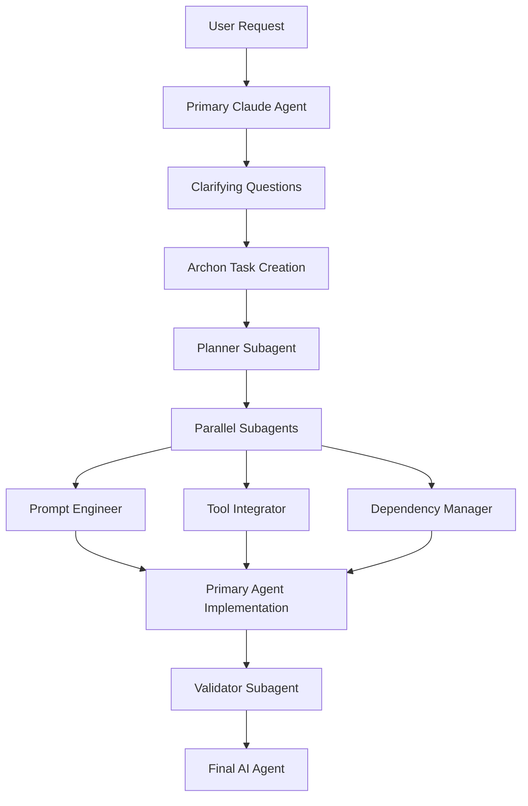

# 🎬 Insights do Vídeo YouTube - Agent Factory

## 📋 Resumo do Vídeo

### Conceito Principal
O vídeo mostra uma **"AI Agent Factory"** usando Claude Code subagents + Archon MCP que automatiza a criação de agents especializados através de um workflow orquestrado.

### Workflow Demonstrado


## 🤖 Subagents Identificados

### 1. **Pydantic AI Planner**
- **Função**: Research + Architecture + Best practices
- **Input**: User requirements
- **Output**: `initial.md` com plano completo
- **Tempo**: ~1 minuto, ~30k tokens
- **Características**:
  - Faz web research extensiva
  - Usa Archon MCP para acessar documentação
  - Cria arquitetura detalhada

### 2. **Prompt Engineer** (Paralelo)
- **Função**: System prompt design
- **Input**: `initial.md`
- **Output**: `prompts.md`
- **Foco**: Criar prompts especializados e efetivos

### 3. **Tool Integrator** (Paralelo)
- **Função**: Tool planning and integration
- **Input**: `initial.md`
- **Output**: `tools.md`
- **Foco**: Definir ferramentas necessárias com pseudo-código

### 4. **Dependency Manager** (Paralelo)
- **Função**: Package + Agent dependencies
- **Input**: `initial.md`
- **Output**: `dependencies.md`
- **Foco**: APIs, database connections, package requirements

### 5. **Validator**
- **Função**: Code validation + Unit tests
- **Input**: Implemented code
- **Output**: `validation.md` + tests
- **Características**: Itera até tudo funcionar perfeitamente

## 🏗️ Arquitetura Técnica Observada

### Comunicação Entre Subagents
```yaml
communication_pattern:
  method: "markdown_files"
  reason: "isolated_contexts" 
  structure:
    - agents/[agent-name]/planning/
      - initial.md      # From planner
      - prompts.md      # From prompt engineer
      - tools.md        # From tool integrator
      - dependencies.md # From dependency manager
      - validation.md   # From validator
```

### Context Engineering
- **Subagents não compartilham contexto** com agent principal
- **Markdown files** servem como "contratos" entre agents
- **Input específico + Output específico** para cada subagent
- **Prevents context pollution** da conversa principal

### Orquestração via CLAUDE.md
```markdown
# Global Rules definindo:
- Workflow trigger conditions
- Phase execution order  
- Parallel execution rules
- Archon integration instructions
- Best practices específicas
```

## 🎯 Patterns Críticos Identificados

### 1. **Phase-Based Execution**
```
Phase 0: Requirements + Clarifying Questions
Phase 1: Planning (Single agent)
Phase 2: Parallel Specification (3 agents)
Phase 3: Implementation (Primary agent)  
Phase 4: Validation (Single agent)
```

### 2. **Parallel Execution Strategy**
- Aguarda **todos os prompts** serem criados
- **Invoca simultaneamente** todos os 3 agents paralelos
- **Aguarda o mais lento** antes de prosseguir
- **Blazing fast** - apenas 1 minuto para 3 agents

### 3. **Context Preservation**
- **Rich context engineering** antes da implementação
- **All planning documents** disponíveis para implementação
- **Comprehensive context** = melhor código final

### 4. **Validation Loop**
- **Always validate** o próprio trabalho
- **Iterate** até estar perfeito
- **Unit tests** obrigatórios
- **Documentation** automática

## 🔧 Integração com Archon MCP

### Task Management
```yaml
archon_integration:
  project_creation: "hybrid-search-rag-agent"
  task_assignment:
    - "Requirements Analysis" → Pydantic AI Planner
    - "System Prompt Design" → Prompt Engineer  
    - "Tool Integration" → Tool Integrator
    - "Dependency Config" → Dependency Manager
    - "Code Implementation" → Claude Code Primary
    - "Validation & Testing" → Validator
  
  status_tracking:
    - pending → doing → done
    - Real-time updates
    - Agent assignment visible
```

### Knowledge Management
```yaml
knowledge_base:
  pydantic_ai_docs: "430 code examples"
  claude_code_docs: "Complete documentation"
  project_specific: "Planning documents storage"
  
mcp_usage:
  search: "RAG through documentation"
  storage: "Planning documents in database"
  sharing: "Team access to context"
```

## 🚀 Aplicação ao Nosso Projeto

### Diferenças Chave
| Vídeo (Agent Factory) | Nosso Projeto (Subagent Factory) |
|----------------------|-----------------------------------|
| Cria AI agents | Cria Claude Code subagents |
| Pydantic AI framework | Framework agnóstico |
| Single use case | Multiple project types |
| Manual trigger | Automated analysis |

### Funcionalidades a Incorporar

#### 1. **Workflow Engine** 
```python
class WorkflowOrchestrator:
    phases = [
        "requirements_analysis",
        "project_analysis", 
        "template_selection",
        "parallel_generation",
        "configuration_merge",
        "deployment",
        "validation"
    ]
    
    def execute_phase(self, phase, context):
        # Implementar lógica de cada fase
        pass
```

#### 2. **Parallel Subagent Execution**
```python
async def execute_parallel_generation(self, templates):
    tasks = [
        self.generate_claude_md(project_analysis),
        self.generate_subagents(selected_templates),
        self.generate_workflows(workflow_requirements),
        self.generate_commands(command_specifications)
    ]
    
    results = await asyncio.gather(*tasks)
    return self.merge_results(results)
```

#### 3. **Markdown Communication Protocol**
```yaml
communication_structure:
  factory/[project-name]/
    analysis/
      - project_analysis.md    # From analyzer
      - template_selection.md  # From selector
    generation/
      - claude_md.md          # From CLAUDE.md generator
      - subagents.md          # From subagent generator
      - workflows.md          # From workflow generator
    deployment/
      - deployment_plan.md    # From deployment planner
      - validation_report.md  # From validator
```

#### 4. **Validation System**
```python
class ConfigurationValidator:
    def validate_full_configuration(self, config):
        validations = [
            self.validate_syntax(),
            self.validate_semantics(),
            self.validate_integration(),
            self.validate_security(),
            self.test_deployment()
        ]
        return ValidationResult(validations)
```

## 📊 Métricas Observadas

### Performance
- **Planning**: 1 minuto, ~30k tokens
- **Parallel Generation**: 1 minuto (3 agents)
- **Implementation**: Tempo variável
- **Validation**: Tempo variável (até funcionar)
- **Total**: ~10-15 minutos para agent completo

### Qualidade
- **3-shot success** (apenas 2 iterações de fix)
- **Fully working agent** no final
- **Complete documentation** incluída
- **Unit tests** validados

## 🎯 Próximos Passos para Nosso Projeto

### 1. **Implementar Workflow Engine**
- Sistema de fases como mostrado no vídeo
- Orquestração via CLAUDE.md global
- Parallel execution support

### 2. **Criar Subagents Especializados**
```
templates/agents/factory/
├── project-analyzer.md     # Analisa projeto
├── template-selector.md    # Seleciona templates 
├── claude-md-generator.md  # Gera CLAUDE.md
├── agent-generator.md      # Gera subagents
├── workflow-generator.md   # Gera workflows
└── validator.md           # Valida configuração
```

### 3. **Integração MCP**
- Task management integration
- Knowledge base para templates
- Project organization

### 4. **Communication Protocol**
- Markdown-based communication
- Context isolation
- Rich context engineering

Este vídeo mostra **exatamente** como implementar uma fábrica real e funcional! 🎯