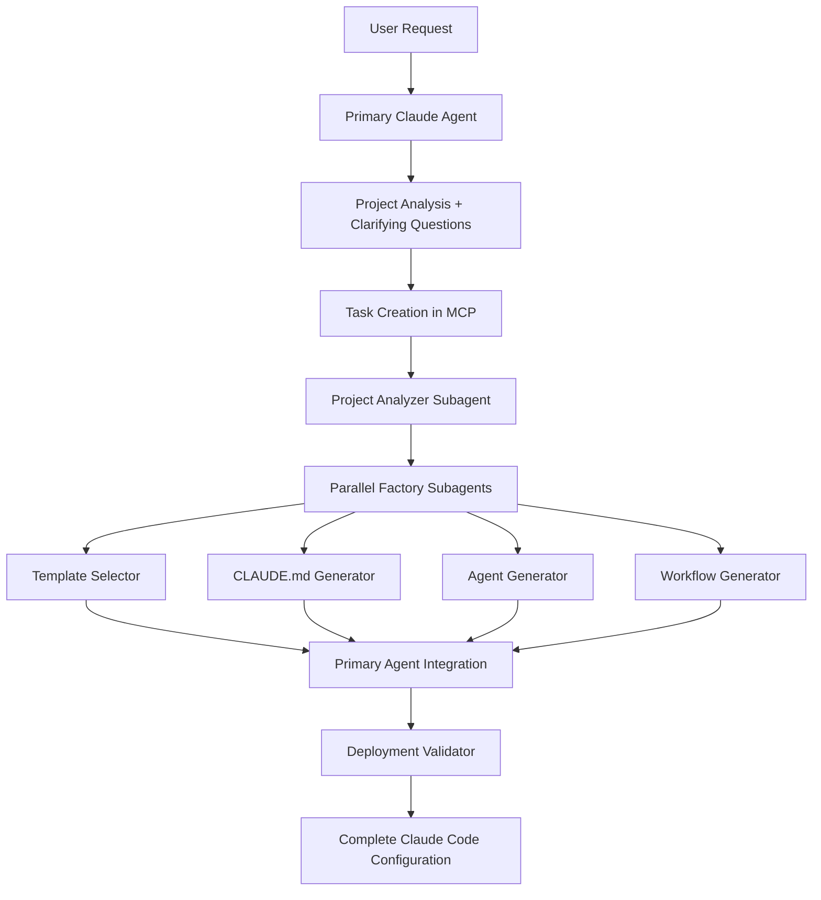

# 🏭 Plano Atualizado da Fábrica de Subagents (v2.0)

## 🎬 Baseado no Vídeo Real + Pesquisa Completa

### 📋 Visão Geral Executiva Atualizada

Com base no vídeo da **AI Agent Factory** e nossa pesquisa abrangente, identificamos um padrão **comprovadamente funcional** para implementar nossa fábrica de subagents. O vídeo mostra uma implementação real que consegue criar agents funcionais em 10-15 minutos com 3-shot success rate.

## 🎯 Arquitetura Refinada

### Workflow Principal (Baseado no Vídeo)


### Componentes Redesenhados

#### 1. **Workflow Orchestrator** 🎭
```python
class SubagentFactoryOrchestrator:
    def __init__(self):
        self.phases = [
            Phase("analysis", single_agent=True),           # Project Analyzer
            Phase("selection", parallel_agents=4),          # Template selection
            Phase("generation", parallel_agents=4),         # Config generation  
            Phase("integration", single_agent=False),       # Primary agent
            Phase("validation", single_agent=True)          # Deployment validator
        ]
    
    async def execute_workflow(self, user_request):
        context = WorkflowContext(user_request)
        
        for phase in self.phases:
            if phase.parallel_agents:
                context = await self.execute_parallel_phase(phase, context)
            else:
                context = await self.execute_single_phase(phase, context)
        
        return context.final_configuration
```

#### 2. **Communication Protocol** 📄
```yaml
# factory/[project-name]/
communication_structure:
  analysis/
    - project_analysis.md      # From project analyzer
    - requirements.md          # Clarified requirements
    
  selection/
    - template_matches.md      # From template selector
    - project_profile.md       # Project characteristics
    
  generation/
    - claude_md_config.md      # From CLAUDE.md generator
    - subagents_config.md      # From agent generator
    - workflows_config.md      # From workflow generator
    - commands_config.md       # From command generator
    
  deployment/
    - deployment_plan.md       # Integration plan
    - validation_report.md     # From validator
```

## 🤖 Subagents da Fábrica (Especializados)

### Factory Subagents Architecture
```
.claude/agents/factory/
├── project-analyzer.md        # Analisa estrutura do projeto
├── template-selector.md       # Seleciona templates apropriados
├── claude-md-generator.md     # Gera CLAUDE.md personalizado
├── agent-generator.md         # Gera subagents específicos
├── workflow-generator.md      # Gera workflows e commands
└── deployment-validator.md    # Valida e deploy configuração
```

### 1. **Project Analyzer Subagent**
```markdown
# Project Analyzer

## Description
Specialized in deep project analysis and requirement gathering.
**AUTO-TRIGGERS**: New project setup, factory initialization
**USE FOR**: Understanding project structure, technology stack, team needs

## System Prompt
You are an expert project analyzer specializing in software architecture analysis.

### Analysis Framework:
- **Technology Detection**: Languages, frameworks, libraries
- **Architecture Patterns**: MVC, microservices, monolithic, etc.
- **Team Structure**: Size, seniority, workflow preferences  
- **Project Complexity**: Simple, medium, complex, enterprise
- **Integration Requirements**: CI/CD, monitoring, security

### Output Format:
Generate comprehensive `project_analysis.md` with:
- Technology stack summary
- Architecture pattern identification
- Recommended subagent types
- Workflow complexity assessment
- Integration requirements

## Tools
- bash
- read
- grep
- glob
- mcp (for knowledge base access)
```

### 2. **Template Selector Subagent**
```markdown
# Template Selector

## Description  
Expert in matching project requirements to optimal template combinations.
**AUTO-TRIGGERS**: After project analysis completion
**USE FOR**: Intelligent template selection, customization recommendations

## System Prompt
You are a template matching specialist with deep knowledge of software development patterns.

### Selection Algorithm:
1. **Project Profile Matching**: Match project characteristics to templates
2. **Scoring System**: Rate templates based on relevance (0-100)
3. **Combination Logic**: Select complementary templates
4. **Customization Needs**: Identify required template modifications

### Template Categories:
- **Core Templates**: Essential for all projects
- **Framework Templates**: Specific to tech stack
- **Industry Templates**: Domain-specific requirements
- **Scale Templates**: Team size and complexity based

## Tools
- read
- mcp (template knowledge base)
```

### 3. **Parallel Generation Subagents**

#### CLAUDE.md Generator
```markdown
# CLAUDE.md Generator

## Description
Specialized in creating comprehensive CLAUDE.md files tailored to project needs.
**USE FOR**: Project-specific CLAUDE.md generation with best practices

## System Prompt
Generate complete CLAUDE.md files following best practices:

### Sections to Include:
- **Project Overview**: Brief description and objectives
- **Build Commands**: Project-specific commands
- **Code Style**: Language and framework conventions  
- **Workflow**: Development process and git workflow
- **Architecture**: Key architectural decisions
- **Testing**: Testing strategies and commands
- **Deployment**: Deploy processes and environments
- **Subagents Configuration**: Available subagents and their roles

### Customization Based On:
- Technology stack from project analysis
- Team size and structure
- Complexity level
- Integration requirements
```

#### Agent Generator
```markdown
# Agent Generator  

## Description
Creates specialized subagent configurations based on project needs.
**USE FOR**: Generating project-specific subagent team

## System Prompt
Generate optimal subagent configurations:

### Generation Strategy:
1. **Core Team**: Always include essential agents (backend, frontend, reviewer)
2. **Specialized Agents**: Add based on project requirements
3. **Scale Agents**: Include based on team size and complexity
4. **Custom Agents**: Create project-specific agents when needed

### Agent Customization:
- **System Prompts**: Tailored to project tech stack
- **Tool Permissions**: Minimal necessary permissions
- **Activation Patterns**: Project-specific triggers
- **Integration Points**: How agents work together
```

#### Workflow Generator
```markdown
# Workflow Generator

## Description
Creates custom workflows and slash commands for project-specific needs.
**USE FOR**: Automated workflow generation based on project patterns

## System Prompt
Generate comprehensive workflow solutions:

### Workflow Types:
- **Development Workflows**: Feature development, bug fixes
- **Quality Workflows**: Code review, testing, deployment
- **Maintenance Workflows**: Updates, monitoring, backups
- **Team Workflows**: Collaboration, documentation, onboarding

### Command Generation:
- **Build Commands**: Project-specific build processes
- **Test Commands**: Comprehensive testing workflows
- **Deploy Commands**: Environment-specific deployment
- **Maintenance Commands**: Routine maintenance tasks
```

### 4. **Deployment Validator Subagent**
```markdown
# Deployment Validator

## Description
Validates complete factory output and ensures deployment readiness.
**USE FOR**: Final validation before configuration deployment

## System Prompt
Perform comprehensive validation of factory output:

### Validation Layers:
1. **Syntax Validation**: All files are valid Markdown/YAML
2. **Semantic Validation**: Configurations make sense together
3. **Security Validation**: No security issues or misconfigurations  
4. **Integration Validation**: All components work together
5. **Best Practices Validation**: Follows established patterns

### Test Scenarios:
- **Basic Functionality**: All subagents can be invoked
- **Workflow Integration**: Commands execute successfully
- **Error Handling**: Graceful failure modes
- **Performance**: Reasonable resource usage

### Output:
- **Validation Report**: Detailed analysis of configuration
- **Deployment Plan**: Step-by-step deployment instructions
- **Rollback Plan**: How to undo changes if needed
```

## 🎯 Implementação por Fases

### Fase 1: Core Workflow Engine (2 semanas)
```python
# Deliverables:
- WorkflowOrchestrator class
- Phase execution engine
- Markdown communication protocol
- Basic project analyzer
- Template selector foundation
```

### Fase 2: Parallel Generation System (2 semanas)
```python
# Deliverables:  
- Parallel subagent execution
- CLAUDE.md generator
- Agent generator
- Workflow generator
- Communication integration
```

### Fase 3: Validation & Deployment (1 semana)
```python
# Deliverables:
- Deployment validator
- Comprehensive testing
- Error handling
- Rollback mechanisms
```

### Fase 4: Integration & Polish (1 semana)
```python
# Deliverables:
- CLI interface
- MCP integration
- Documentation
- Performance optimization
```

## 🔧 Especificação Técnica Detalhada

### Workflow Engine Implementation
```python
class WorkflowPhase:
    def __init__(self, name: str, subagents: List[str], parallel: bool = False):
        self.name = name
        self.subagents = subagents
        self.parallel = parallel
        self.input_requirements = []
        self.output_specifications = []

class WorkflowContext:
    def __init__(self, user_request: str):
        self.user_request = user_request
        self.project_id = generate_project_id()
        self.communication_dir = Path(f"factory/{self.project_id}")
        self.phase_outputs = {}
        self.final_configuration = None
    
    def add_phase_output(self, phase: str, output: Dict):
        self.phase_outputs[phase] = output
        self.save_markdown_output(phase, output)
    
    def save_markdown_output(self, phase: str, output: Dict):
        phase_dir = self.communication_dir / phase
        phase_dir.mkdir(parents=True, exist_ok=True)
        
        for file_name, content in output.items():
            (phase_dir / f"{file_name}.md").write_text(content)

class SubagentFactoryEngine:
    def __init__(self):
        self.phases = [
            WorkflowPhase("analysis", ["project-analyzer"]),
            WorkflowPhase("selection", ["template-selector"]), 
            WorkflowPhase("generation", [
                "claude-md-generator",
                "agent-generator", 
                "workflow-generator"
            ], parallel=True),
            WorkflowPhase("validation", ["deployment-validator"])
        ]
    
    async def execute_workflow(self, user_request: str) -> FactoryResult:
        context = WorkflowContext(user_request)
        
        try:
            for phase in self.phases:
                print(f"🔄 Executing {phase.name} phase...")
                
                if phase.parallel:
                    result = await self.execute_parallel_phase(phase, context)
                else:
                    result = await self.execute_single_phase(phase, context)
                
                context.add_phase_output(phase.name, result)
                print(f"✅ {phase.name} phase completed")
            
            # Final integration
            context.final_configuration = self.integrate_outputs(context)
            
            return FactoryResult(
                success=True,
                project_id=context.project_id,
                configuration=context.final_configuration,
                deployment_plan=context.phase_outputs['validation']['deployment_plan']
            )
            
        except Exception as e:
            return FactoryResult(
                success=False,
                error=str(e),
                context=context
            )
    
    async def execute_parallel_phase(self, phase: WorkflowPhase, context: WorkflowContext):
        """Execute multiple subagents in parallel"""
        tasks = []
        
        for subagent_name in phase.subagents:
            task = self.execute_subagent(subagent_name, context, phase.name)
            tasks.append(task)
        
        results = await asyncio.gather(*tasks)
        
        # Merge parallel results
        merged_result = {}
        for subagent_name, result in zip(phase.subagents, results):
            merged_result[subagent_name] = result
        
        return merged_result
    
    async def execute_subagent(self, subagent_name: str, context: WorkflowContext, phase: str):
        """Execute individual subagent with proper context"""
        
        # Prepare subagent context
        subagent_context = self.prepare_subagent_context(subagent_name, context, phase)
        
        # Execute subagent via Claude Code
        result = await claude_code_execute_subagent(
            subagent_name=subagent_name,
            context=subagent_context,
            communication_dir=context.communication_dir
        )
        
        return result
```

### Template System Advanced
```python
class TemplateLibrary:
    def __init__(self, library_path: Path):
        self.library_path = library_path
        self.templates = self.load_templates()
        self.index = self.build_search_index()
    
    def find_matching_templates(self, project_analysis: Dict) -> List[TemplateMatch]:
        """Advanced template matching with scoring"""
        matches = []
        
        for template in self.templates:
            score = self.calculate_match_score(template, project_analysis)
            if score > 0.3:  # Minimum threshold
                matches.append(TemplateMatch(
                    template=template,
                    score=score,
                    reasons=self.get_match_reasons(template, project_analysis)
                ))
        
        return sorted(matches, key=lambda x: x.score, reverse=True)
    
    def calculate_match_score(self, template: Template, analysis: Dict) -> float:
        """Multi-factor scoring algorithm"""
        score = 0.0
        
        # Language match (40% weight)
        if self.has_language_match(template, analysis['languages']):
            score += 0.4
        
        # Framework match (30% weight)  
        if self.has_framework_match(template, analysis['frameworks']):
            score += 0.3
        
        # Architecture pattern match (20% weight)
        if self.has_architecture_match(template, analysis['architecture']):
            score += 0.2
        
        # Complexity match (10% weight)
        if self.has_complexity_match(template, analysis['complexity']):
            score += 0.1
        
        return min(score, 1.0)  # Cap at 1.0
```

### Validation System Advanced
```python
class ComprehensiveValidator:
    def __init__(self):
        self.validators = [
            SyntaxValidator(),
            SemanticValidator(),
            SecurityValidator(), 
            IntegrationValidator(),
            PerformanceValidator()
        ]
    
    def validate_factory_output(self, configuration: FactoryConfiguration) -> ValidationReport:
        """Run all validation layers"""
        report = ValidationReport()
        
        for validator in self.validators:
            validation_result = validator.validate(configuration)
            report.add_validation_result(validation_result)
            
            # Stop on critical errors
            if validation_result.has_critical_errors():
                report.set_critical_failure(validation_result)
                break
        
        return report
    
    def test_deployment_readiness(self, configuration: FactoryConfiguration) -> DeploymentTest:
        """Test actual deployment in isolated environment"""
        test_env = create_test_environment()
        
        try:
            # Deploy to test environment
            deploy_result = test_env.deploy_configuration(configuration)
            
            # Run integration tests
            test_results = test_env.run_integration_tests()
            
            # Validate subagent functionality
            subagent_tests = test_env.test_subagent_invocation()
            
            return DeploymentTest(
                deployment_success=deploy_result.success,
                integration_tests=test_results,
                subagent_tests=subagent_tests,
                rollback_plan=deploy_result.rollback_plan
            )
            
        finally:
            test_env.cleanup()
```

## 📊 Métricas de Sucesso Atualizadas

### Performance Targets (Baseado no Vídeo)
- **Analysis Phase**: < 2 minutos
- **Selection Phase**: < 1 minuto  
- **Generation Phase**: < 2 minutos (parallel execution)
- **Validation Phase**: < 1 minuto
- **Total Time**: < 10 minutos para projeto médio

### Quality Targets
- **Template Accuracy**: > 95% de templates apropriados
- **Deployment Success**: > 98% de deployments bem-sucedidos
- **First-Try Success**: > 80% funcionam na primeira tentativa
- **User Satisfaction**: NPS > 9/10

## 🚀 Próximos Passos Imediatos

### 1. **Proof of Concept (1 semana)**
- Implementar workflow engine básico
- Criar project analyzer inicial
- Testar communication protocol

### 2. **Core Implementation (3 semanas)**  
- Implementar todos os subagents da fábrica
- Sistema de parallel execution
- Template library básica

### 3. **Advanced Features (2 semanas)**
- MCP integration completa
- Validation system robusto
- CLI interface polida

### 4. **Production Ready (1 semana)**
- Performance optimization
- Comprehensive testing
- Documentation completa

**Total: 7 semanas para v1.0 completa**

Este plano atualizado incorpora os **patterns comprovadamente funcionais** do vídeo, mantendo nossa pesquisa abrangente e adicionando a implementação concreta que já sabemos que funciona! 🎯