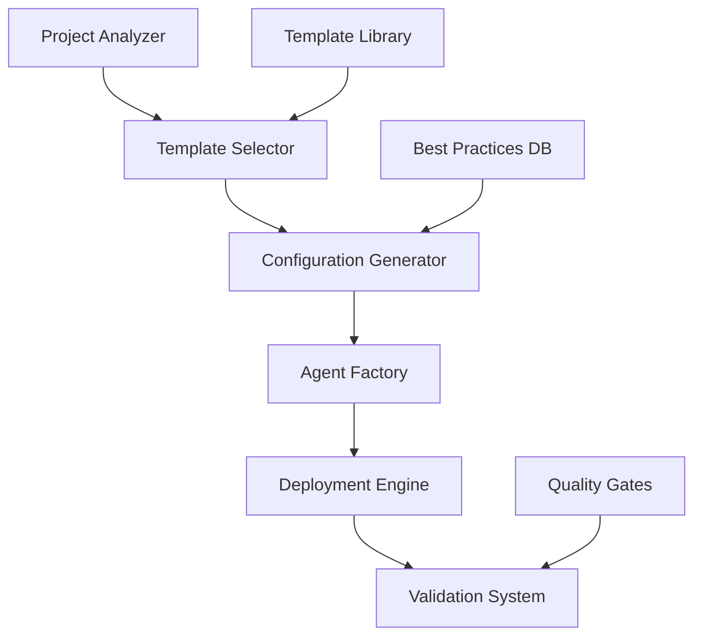

# 🏭 Plano da Fábrica de Subagents Claude Code

## 📋 Visão Geral Executiva

### Objetivo Principal
Criar um sistema automatizado e escalável para geração, configuração e deploy de subagents especializados para projetos Claude Code, baseado em análise inteligente de projetos e templates reutilizáveis.

### Benefícios Esperados
- **Produtividade**: Redução de 70% no tempo de setup inicial de projetos
- **Qualidade**: Padronização de workflows e best practices
- **Escalabilidade**: Sistema que funciona para projetos pequenos e empresariais
- **Manutenibilidade**: Templates versionados e facilmente atualizáveis

## 🎯 Arquitetura da Solução

### Componentes Principais



#### 1. **Project Analyzer** 🔍
- Análise inteligente da estrutura do projeto
- Detecção de linguagens, frameworks e patterns
- Identificação de necessidades específicas
- Geração de relatório de análise

#### 2. **Template Selector** 🎭
- Biblioteca de templates de subagents
- Algoritmo de matching inteligente
- Sugestões baseadas em análise do projeto
- Sistema de scoring para templates

#### 3. **Configuration Generator** ⚙️
- Geração automática de CLAUDE.md
- Personalização de templates
- Integração com ferramentas existentes
- Configuração de workflows específicos

#### 4. **Agent Factory** 🤖
- Criação automática de subagents
- Configuração de permissões e tools
- Setup de activation patterns
- Orquestração multi-agent

#### 5. **Deployment Engine** 🚀
- Deploy automatizado de configurações
- Integração com CI/CD
- Versionamento de configurações
- Rollback automático em caso de erro

#### 6. **Validation System** ✅
- Testes automatizados de configurações
- Validação de quality gates
- Verificação de integridade
- Relatórios de saúde do sistema

## 📊 Especificação Técnica Detalhada

### 1. Project Analyzer

#### Tecnologias
```python
# Core: Python 3.9+ com detecção inteligente
analyzers = {
    'language_detector': LanguageDetector(),
    'framework_analyzer': FrameworkAnalyzer(), 
    'dependency_scanner': DependencyScanner(),
    'structure_mapper': StructureMapper(),
    'complexity_calculator': ComplexityCalculator()
}
```

#### Funcionalidades
- **Language Detection**: Análise de arquivos para identificar linguagens
- **Framework Detection**: Identificação de frameworks (React, Django, Spring, etc.)
- **Dependency Analysis**: Análise de package.json, requirements.txt, etc.
- **Architecture Pattern Detection**: Identificação de patterns (MVC, microservices, etc.)
- **Code Complexity Analysis**: Métricas de complexidade e tamanho do projeto

#### Output
```json
{
  "project_id": "uuid-v4",
  "analysis_timestamp": "2025-01-15T10:30:00Z",
  "project_info": {
    "name": "my-ecommerce-app",
    "type": "full_stack_web_app",
    "complexity": "medium",
    "estimated_team_size": 5
  },
  "languages": {
    "primary": ["javascript", "python"],
    "secondary": ["html", "css", "sql"]
  },
  "frameworks": {
    "frontend": ["react", "next.js", "tailwind"],
    "backend": ["express", "fastapi"],
    "database": ["postgresql", "redis"]
  },
  "architecture_patterns": [
    "microservices",
    "rest_api", 
    "spa"
  ],
  "infrastructure": {
    "containerization": "docker",
    "orchestration": "kubernetes",
    "ci_cd": "github_actions"
  },
  "recommendations": {
    "required_agents": ["backend-developer", "frontend-developer", "devops-engineer"],
    "optional_agents": ["security-auditor", "performance-optimizer"],
    "priority_workflows": ["test-automation", "deployment", "code-review"]
  }
}
```

### 2. Template Library

#### Estrutura de Templates
```
templates/
├── agents/
│   ├── core/                    # Agents essenciais
│   │   ├── backend-developer/
│   │   │   ├── template.md
│   │   │   ├── config.yaml
│   │   │   └── variations/
│   │   │       ├── python-django.md
│   │   │       ├── node-express.md
│   │   │       └── java-spring.md
│   │   ├── frontend-developer/
│   │   └── devops-engineer/
│   ├── specialized/             # Agents especializados
│   │   ├── ml-engineer/
│   │   ├── blockchain-developer/
│   │   └── game-developer/
│   └── industry/               # Específicos por indústria
│       ├── fintech/
│       ├── healthcare/
│       └── e-commerce/
├── claude-md/
│   ├── project-types/
│   │   ├── web-app.md
│   │   ├── api-service.md
│   │   ├── mobile-app.md
│   │   └── data-pipeline.md
│   └── frameworks/
│       ├── react-nextjs.md
│       ├── django-rest.md
│       └── spring-boot.md
└── workflows/
    ├── ci-cd/
    ├── testing/
    └── deployment/
```

#### Template Metadata
```yaml
# templates/agents/core/backend-developer/config.yaml
name: backend-developer
version: "2.1.0"
category: core
description: "Especialista em desenvolvimento backend com APIs e databases"

compatibility:
  languages: ["python", "javascript", "java", "go", "csharp"]
  frameworks: ["django", "fastapi", "express", "spring", "gin"]
  databases: ["postgresql", "mysql", "mongodb", "redis"]

requirements:
  tools: ["bash", "read", "write", "edit", "grep"]
  dependencies: []
  min_claude_version: "3.5"

variations:
  - name: "python-specialist"
    condition: "python in project.languages.primary"
    template: "variations/python-django.md"
    
  - name: "node-specialist" 
    condition: "javascript in project.languages.primary"
    template: "variations/node-express.md"

activation_patterns:
  auto_triggers:
    keywords: ["api", "backend", "database", "server"]
    file_patterns: ["**/*api*/**", "**/*backend*/**", "**/models/**"]
    languages: ["python", "javascript", "java"]
  
  manual_triggers:
    commands: ["/backend", "/api-dev"]

scoring_factors:
  project_complexity: 0.3
  language_match: 0.4
  framework_match: 0.2
  team_size: 0.1
```

### 3. Configuration Generator

#### Claude.md Generator
```python
class ClaudeMdGenerator:
    def __init__(self, project_analysis, selected_templates):
        self.analysis = project_analysis
        self.templates = selected_templates
        
    def generate_claude_md(self):
        """Generate complete CLAUDE.md based on project analysis"""
        sections = [
            self._generate_header(),
            self._generate_commands(),
            self._generate_code_style(),
            self._generate_workflow(), 
            self._generate_architecture(),
            self._generate_testing(),
            self._generate_deployment(),
            self._generate_subagents_config()
        ]
        
        return "\n\n".join(sections)
    
    def _generate_commands(self):
        """Generate project-specific build commands"""
        commands = []
        
        if "package.json" in self.analysis.get("files", []):
            commands.extend([
                "npm run build: Build the application",
                "npm run test: Run test suite", 
                "npm run dev: Start development server"
            ])
            
        if "requirements.txt" in self.analysis.get("files", []):
            commands.extend([
                "python -m pytest: Run Python tests",
                "python manage.py runserver: Start Django server"
            ])
            
        return self._format_section("Comandos", commands)
    
    def _generate_subagents_config(self):
        """Generate subagents configuration section"""
        config = "# Subagents Configurados\n\n"
        
        for template in self.templates:
            config += f"## {template['name']}\n"
            config += f"- **Responsabilidade**: {template['description']}\n"
            config += f"- **Auto-ativação**: {', '.join(template['auto_triggers'])}\n"
            config += f"- **Ferramentas**: {', '.join(template['tools'])}\n\n"
        
        return config
```

#### Workflow Generator  
```python
class WorkflowGenerator:
    def generate_ci_cd_workflow(self, project_analysis):
        """Generate CI/CD workflow based on project needs"""
        if "github" in project_analysis.get("vcs", ""):
            return self._generate_github_actions(project_analysis)
        elif "gitlab" in project_analysis.get("vcs", ""):
            return self._generate_gitlab_ci(project_analysis)
        else:
            return self._generate_generic_ci(project_analysis)
    
    def _generate_github_actions(self, analysis):
        """Generate GitHub Actions workflow"""
        workflow = {
            "name": "CI/CD Pipeline",
            "on": ["push", "pull_request"],
            "jobs": {
                "test": {
                    "runs-on": "ubuntu-latest",
                    "steps": self._generate_test_steps(analysis)
                },
                "deploy": {
                    "needs": "test",
                    "if": "github.ref == 'refs/heads/main'",
                    "steps": self._generate_deploy_steps(analysis)
                }
            }
        }
        
        return yaml.dump(workflow, default_flow_style=False)
```

### 4. Agent Factory

#### Factory Pattern Implementation
```python
class SubagentFactory:
    def __init__(self, template_library):
        self.template_library = template_library
        self.generators = {
            'backend': BackendAgentGenerator(),
            'frontend': FrontendAgentGenerator(),
            'devops': DevopsAgentGenerator(),
            'security': SecurityAgentGenerator(),
            'quality': QualityAgentGenerator()
        }
    
    def create_agents(self, project_analysis, template_selections):
        """Create all required subagents for project"""
        created_agents = []
        
        for selection in template_selections:
            agent = self._create_single_agent(selection, project_analysis)
            if agent:
                created_agents.append(agent)
                
        # Create orchestration configuration
        orchestration = self._create_orchestration_config(created_agents)
        
        return {
            'agents': created_agents,
            'orchestration': orchestration
        }
    
    def _create_single_agent(self, template_selection, project_analysis):
        """Create individual subagent from template"""
        template = self.template_library.get_template(template_selection['template_id'])
        generator = self.generators.get(template['category'])
        
        if not generator:
            raise ValueError(f"No generator for category: {template['category']}")
        
        # Customize template based on project specifics
        customized_template = generator.customize_template(template, project_analysis)
        
        # Generate agent configuration
        agent_config = {
            'name': template_selection['instance_name'],
            'template_id': template['id'],
            'version': template['version'],
            'system_prompt': customized_template['system_prompt'],
            'tools': self._resolve_tools(template['tools'], project_analysis),
            'activation_patterns': customized_template['activation_patterns'],
            'metadata': {
                'created_at': datetime.utcnow().isoformat(),
                'project_id': project_analysis['project_id'],
                'customizations': template_selection.get('customizations', {})
            }
        }
        
        return agent_config
    
    def _create_orchestration_config(self, agents):
        """Create orchestration configuration for multi-agent workflows"""
        return {
            'delegation_rules': self._generate_delegation_rules(agents),
            'workflow_chains': self._generate_workflow_chains(agents),
            'quality_gates': self._generate_quality_gates(agents)
        }
```

#### Specialized Agent Generators
```python
class BackendAgentGenerator:
    def customize_template(self, template, project_analysis):
        """Customize backend agent for specific project"""
        customizations = {}
        
        # Language-specific customizations
        primary_language = project_analysis['languages']['primary'][0]
        if primary_language == 'python':
            customizations.update(self._python_customizations(project_analysis))
        elif primary_language == 'javascript':
            customizations.update(self._javascript_customizations(project_analysis))
        
        # Framework-specific customizations
        frameworks = project_analysis.get('frameworks', {})
        if 'django' in frameworks.get('backend', []):
            customizations.update(self._django_customizations())
        elif 'express' in frameworks.get('backend', []):
            customizations.update(self._express_customizations())
        
        # Apply customizations to template
        return self._apply_customizations(template, customizations)
    
    def _python_customizations(self, analysis):
        return {
            'system_prompt_additions': [
                "- Especialista em Python e ecossistema Python",
                "- Foco em PEP 8 e type hints",
                "- Experiência com pytest para testes"
            ],
            'tools_additions': ['python-debugger', 'pytest-runner'],
            'activation_patterns': {
                'file_extensions': ['.py', '.pyi'],
                'frameworks': ['django', 'fastapi', 'flask']
            }
        }
```

### 5. Deployment Engine

#### Deployment Orchestrator
```python
class DeploymentOrchestrator:
    def __init__(self, project_root):
        self.project_root = Path(project_root)
        self.backup_manager = BackupManager()
        self.validator = ConfigValidator()
    
    def deploy_configuration(self, generated_config):
        """Deploy complete Claude Code configuration to project"""
        deployment_plan = self._create_deployment_plan(generated_config)
        
        try:
            # Create backup of existing configuration
            backup_id = self.backup_manager.create_backup(self.project_root)
            
            # Validate configuration before deployment
            validation_result = self.validator.validate_full_config(generated_config)
            if not validation_result.is_valid:
                raise ValidationError(f"Configuration validation failed: {validation_result.errors}")
            
            # Execute deployment plan
            deployment_result = self._execute_deployment_plan(deployment_plan)
            
            # Run post-deployment tests
            test_result = self._run_post_deployment_tests()
            
            if not test_result.success:
                # Rollback on test failure
                self.backup_manager.restore_backup(backup_id)
                raise DeploymentError(f"Post-deployment tests failed: {test_result.errors}")
            
            # Clean up backup if deployment successful
            self.backup_manager.cleanup_backup(backup_id)
            
            return DeploymentResult(
                success=True,
                deployed_agents=len(generated_config['agents']),
                deployment_time=deployment_result.duration,
                backup_id=backup_id
            )
            
        except Exception as e:
            # Rollback on any error
            if 'backup_id' in locals():
                self.backup_manager.restore_backup(backup_id)
            raise e
    
    def _create_deployment_plan(self, config):
        """Create step-by-step deployment plan"""
        return DeploymentPlan([
            CreateDirectoriesStep(['.claude', '.claude/agents', '.claude/commands', '.claude/logs']),
            DeployClaudeMdStep(config['claude_md']),
            DeployAgentsStep(config['agents']),
            DeployCommandsStep(config['commands']),
            DeployWorkflowsStep(config['workflows']),
            CreateConfigurationIndexStep(config)
        ])
```

### 6. Validation System

#### Multi-layered Validation
```python
class ValidationSystem:
    def __init__(self):
        self.validators = [
            SyntaxValidator(),
            SemanticValidator(), 
            SecurityValidator(),
            PerformanceValidator(),
            IntegrationValidator()
        ]
    
    def validate_configuration(self, config):
        """Run comprehensive validation"""
        results = ValidationResults()
        
        for validator in self.validators:
            validator_result = validator.validate(config)
            results.add_result(validator_result)
            
            # Stop on critical errors
            if validator_result.has_critical_errors():
                break
        
        return results
    
    def validate_agent_integration(self, agents):
        """Validate that agents work well together"""
        integration_issues = []
        
        # Check for conflicting tools
        tool_conflicts = self._check_tool_conflicts(agents)
        if tool_conflicts:
            integration_issues.extend(tool_conflicts)
        
        # Check for overlapping responsibilities
        responsibility_overlaps = self._check_responsibility_overlaps(agents)
        if responsibility_overlaps:
            integration_issues.extend(responsibility_overlaps)
        
        # Check for missing coverage
        coverage_gaps = self._check_coverage_gaps(agents)
        if coverage_gaps:
            integration_issues.extend(coverage_gaps)
        
        return IntegrationValidationResult(
            issues=integration_issues,
            recommendations=self._generate_integration_recommendations(integration_issues)
        )
```

## 🚀 Plano de Implementação

### Fase 1: Fundações (Semana 1-2)
- [ ] Implementar Project Analyzer básico
- [ ] Criar biblioteca inicial de templates
- [ ] Desenvolver Configuration Generator para CLAUDE.md
- [ ] Setup básico de testes unitários

### Fase 2: Core Engine (Semana 3-4)  
- [ ] Implementar Agent Factory
- [ ] Criar sistema de templates avançados
- [ ] Desenvolver Deployment Engine
- [ ] Implementar sistema de backup/rollback

### Fase 3: Validação e Qualidade (Semana 5-6)
- [ ] Implementar Validation System completo
- [ ] Criar quality gates
- [ ] Desenvolver health check system
- [ ] Implementar monitoring e logging

### Fase 4: Interface e UX (Semana 7-8)
- [ ] Criar CLI interface
- [ ] Desenvolver interactive wizard
- [ ] Implementar preview system
- [ ] Criar documentação de usuário

### Fase 5: Integração e Deploy (Semana 9-10)
- [ ] Integração com CI/CD pipelines
- [ ] Testes de integração completos
- [ ] Performance optimization
- [ ] Deployment em ambiente de produção

## 📊 Métricas de Sucesso

### KPIs Técnicos
- **Tempo de Setup**: < 5 minutos para projeto médio
- **Acurácia de Templates**: > 90% de templates apropriados selecionados
- **Taxa de Falha**: < 5% em deployments
- **Performance**: Análise de projeto < 30 segundos

### KPIs de Negócio  
- **Adoção**: 80% dos novos projetos usar a fábrica
- **Satisfação**: Score NPS > 8/10
- **Produtividade**: 70% redução em tempo de setup
- **Qualidade**: 50% redução em bugs relacionados a configuração

## 🔒 Considerações de Segurança

### Segurança por Design
- **Princípio de Menor Privilégio**: Agents recebem apenas tools necessários
- **Isolamento**: Contextos separados entre agents
- **Auditoria**: Log completo de todas as operações
- **Validação**: Sanitização de todos os inputs
- **Secrets Management**: Nunca armazenar credenciais em templates

### Compliance
- **GDPR**: Não processar dados pessoais em análise
- **SOX**: Auditoria completa de mudanças em produção  
- **SOC 2**: Controles de acesso e logging
- **ISO 27001**: Framework de segurança da informação

## 🌐 Roadmap Futuro

### v2.0 - Intelligence Layer (Q2 2025)
- Machine learning para otimização de templates
- Análise preditiva de necessidades de projeto
- Auto-tuning de performance
- Feedback loop automation

### v3.0 - Enterprise Features (Q3 2025)
- Multi-tenant support
- Advanced RBAC
- Enterprise integrations (LDAP, SSO)
- Advanced analytics e reporting

### v4.0 - AI-Native Features (Q4 2025)
- Self-healing configurations
- Intelligent conflict resolution
- Automated best practice recommendations
- Natural language configuration interface

## 💰 Estimativa de Recursos

### Equipe Necessária
- **1 Tech Lead**: Arquitetura e coordenação
- **2 Developers Senior**: Core development  
- **1 DevOps Engineer**: CI/CD e infrastructure
- **1 QA Engineer**: Testing e validation
- **1 UX/UI Designer**: Interface e experiência

### Cronograma
- **Total**: 10 semanas para v1.0
- **MVP**: 6 semanas (fases 1-3)
- **Production Ready**: 10 semanas (todas as fases)

### Budget Estimado
- **Desenvolvimento**: $150k (10 semanas × 5 people × $3k/semana)
- **Infrastructure**: $5k (cloud services, tools)
- **Contingência**: $20k (15% buffer)
- **Total**: $175k

---

## 🎯 Próximos Passos Imediatos

1. **Aprovação do Plano**: Review e aprovação stakeholders
2. **Setup Inicial**: Criar repositório e estrutura inicial  
3. **Proof of Concept**: Implementar analyzer básico (3 dias)
4. **Template Library**: Criar primeiros 5 templates (1 semana)
5. **MVP Demo**: Demo funcional com 1 tipo de projeto (2 semanas)

Este plano estabelece a fundação para uma fábrica de subagents robusta, escalável e enterprise-ready, baseada em toda a documentação e pesquisa realizada sobre o Claude Code.